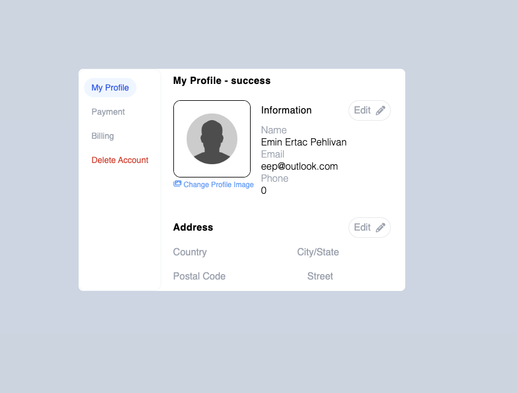
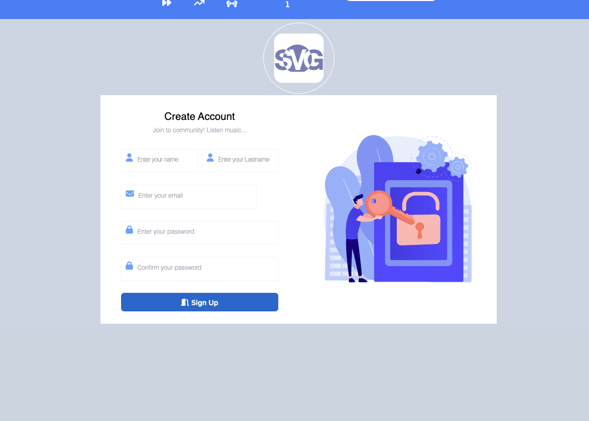
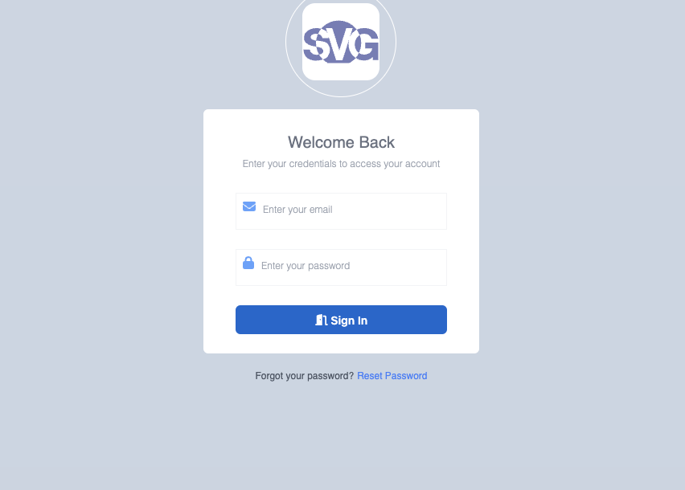
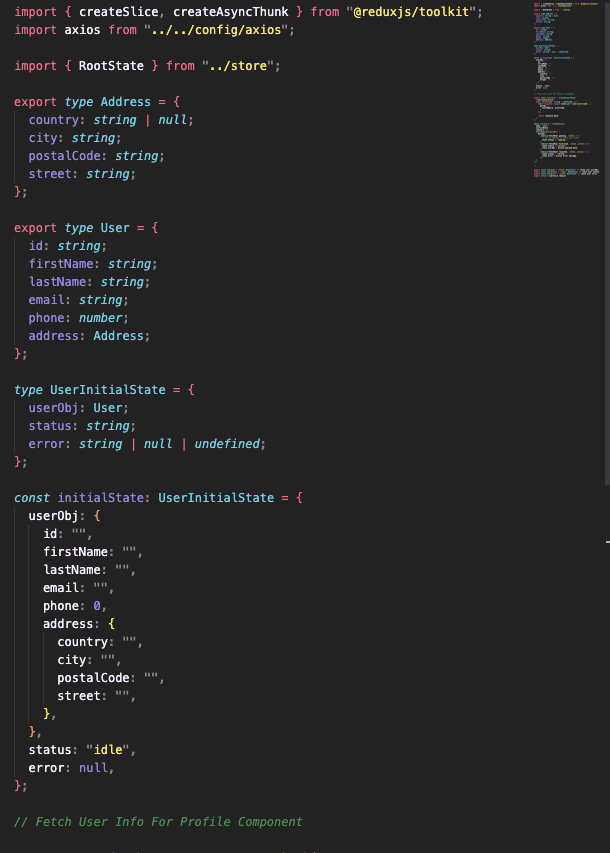
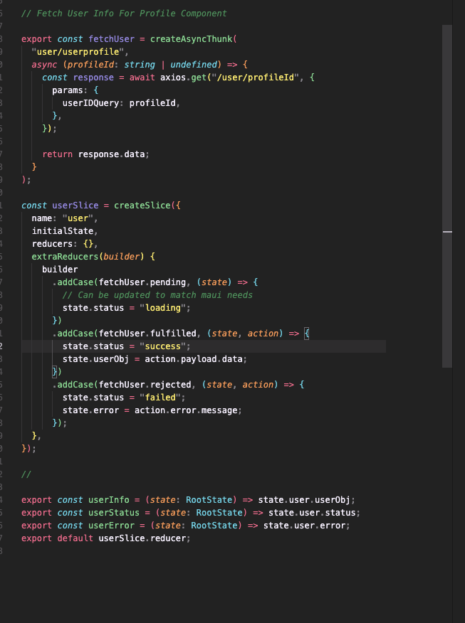
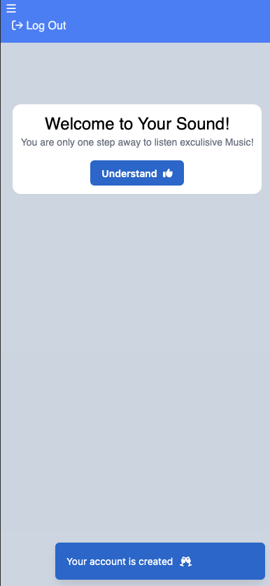

# Your Sound

Your sound is a music publish social platform.You can publish your music , you can listen other peoples work give them reaction and comment. You can also add new friends and realtime chat with them.

## Table of Contents

- [Proje Description](#description)
- [License](#license)

## Proje Description

"This area is separated into three main topics: FrontEnd, BackEnd, and DataBase. I will explain what I have done in the project so far and enlighten you to clarify my capabilities."

#Front-End

Techonologies: React , Redux , Tailwind CSS

For front-end development I use Vite. For routing react-router is used.
PrivateRoute middleware protects private routes.

During development of navbar. HeadlesUi and MaterialUi libraries are used and also with the power of tailwind css responsible navbar is added into the project.

In the project , there is a profile page that user can upload their pictures , view and change user informations.

Sign Up Page

Log in Page

Redux and redux-toolkit is used in the project.

Registerslice is created and implemented into project , registerslice is responsible of creating new user and also depends of return , user is navigated to welcome page , or recieve error notification if the email user put is already exist in the system.

Welcome Page,
In welcome page I also used material UI Snackbar component , this component inform the user , they succesfully created new account.

